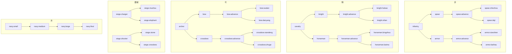

# 兵種樹（Troop Kind Tree）

設計原則（對齊你說的 tree）：

| 兵科大類 | 分叉規則 |
|----------|----------|
| **步、騎、弓** | 根 → **2 條線** → 各可升級 **advance** → 每條 advance 再 **2 個特色**（共 2×2 葉子） |
| **器械** | **衝車**、**井欄** 兩條根 → 各再 **2 個** 子節點（共 4 葉） |
| **水軍** | **一條線** 到底：走舸 → 蒙衝 → 樓船 → 鬥艦 |

`TroopType`（程式大類）與樹根對應：`Infantry` / `Cavalry` / `Archer` / `Spege` / `Navy`。  
具體節點 id 用 **`troop.kind.*` 鍵**（見 `chinese/unit.properties`）。

---

## 步（Infantry）— 槍線 × 甲線

```text
輕步兵 [infantry]  （起點／未分岔前的基礎步卒，可視為編制預設）
    │
    ├─ 長槍兵 [spear]
    │       └─ 精銳戟兵 [spear.advance]
    │               ├─ 青洲兵 [spear.chinzhou]
    │               └─ 大戟士 [spear.daji]
    │
    └─ 重步兵 [armor]
            └─ 精銳步兵 [armor.advance]
                    ├─ 陷陣營 [armor.xianzhen]
                    └─ 白耗兵 [armor.baihau]
```

**建議特色**

- **槍線**：抗騎、列陣；advance 後偏「地域／重槍」二選（青州、大戟）。
- **甲線**：高防肉盾；advance 後偏「衝鋒特化 vs 山地特化」（陷陣、白毦）。

---

## 騎（Cavalry）— 重騎線 × 游騎線

```text
輕騎兵 [cavalry]  （起點）
    │
    ├─ 重騎兵 [knight]
    │       └─ 精銳騎兵 [knight.advance]
    │               ├─ 虎豹騎 [knight.hubao]
    │               └─ 西涼鐵騎 [knight.xilian]
    │
    └─ 游騎兵 [horseman]
            └─ 烏桓突騎 [horseman.advance]
                    ├─ 并州鐵騎 [horseman.bingzhou]
                    └─ 白馬義從 [horseman.baima]
```

**建議特色**

- **重騎線**：平原衝鋒、勢力鎖（虎豹）、西北地形（西涼）。
- **游騎線**：騷擾、突襲；advance 後并州／白馬（對弓、機動）。

---

## 弓（Archer）— 弓線 × 弩線

```text
弓兵 [archer]  （起點）
    │
    ├─ 長弓兵 [bow]
    │       └─ 精銳弓兵 [bow.advance]
    │               ├─ 無當飛軍 [bow.wudan]
    │               └─ 丹陽弓 [bow.danyang]   （文案可與 archer 區分，表 id 不同）
    │
    └─ 弩兵 [crossbow]
            └─ 重弩兵 [crossbow.advance]
                    ├─ 先登死士 [crossbow.xiandeng]
                    └─ 諸葛連弩 [crossbow.zhuge]
```

**建議特色**

- **弓線**：射程、火計協同；advance 後游擊／丹陽。
- **弩線**：破甲、攻城；advance 後先登爆發／連弩科技。

---

## 器械（Siege）— 衝車叉 × 井欄叉（各 2 子）

```text
器械 [troop.type.siege]
    │
    ├─ 衝車 [siege.charger]
    │       ├─ 木獸 [siege.mushou]
    │       └─ 南蠻象兵 [siege.elephant]
    │
    └─ 井欄 [siege.shooter]
            ├─ 投石 [siege.stone]
            └─ 弩床 [siege.crossbow]
```

**建議特色**

- **衝車叉**：破城門／火攻（木獸）、叢林南地（象兵）。
- **井欄叉**：遠程對牆（投石範圍）、固定火力（弩床）。

（器械沒有 `.advance` 層，是「兩根幹 → 各兩葉」。）

---

## 水軍（Navy）— 單線四階

```text
走舸 [navy.small]
  → 蒙衝 [navy.medium]
    → 樓船 [navy.large]
      → 鬥艦 [navy.final]
```

**建議特色**：運輸 → 標準水戰 → 弓弩平台 → 頂級主力；科技／港口解鎖逐階。

---

## 升級路徑（程式用）



---

## properties 鍵 ↔ 樹節點

| 鍵（不含 `troop.kind.` 前綴） | 層級 |
|-----------------------------|------|
| `infantry` | 步·起點 |
| `spear` / `armor` | 步·第一分叉 |
| `spear.advance` / `armor.advance` | 步·第二層 |
| `spear.chinzhou` 等四個 | 步·葉子 |
| `cavalry` | 騎·起點 |
| `knight` / `horseman` | 騎·第一分叉 |
| … | 同上模式 |
| `archer` | 弓·起點 |
| `bow` / `crossbow` | 弓·第一分叉 |
| `siege.charger` / `siege.shooter` | 器械·兩根幹 |
| `siege.mushou` 等四個 | 器械·葉子 |
| `navy.small` → `navy.final` | 水·線性四階 |

程式讀顯示名：`UnitConfigUtil.GetKindDisplayName("spear.daji")`  
樹結構查詢：`TroopKindTree.TryGetNode("spear.daji")`、`GetChildren`、`GetNextInLine`（水軍）。
